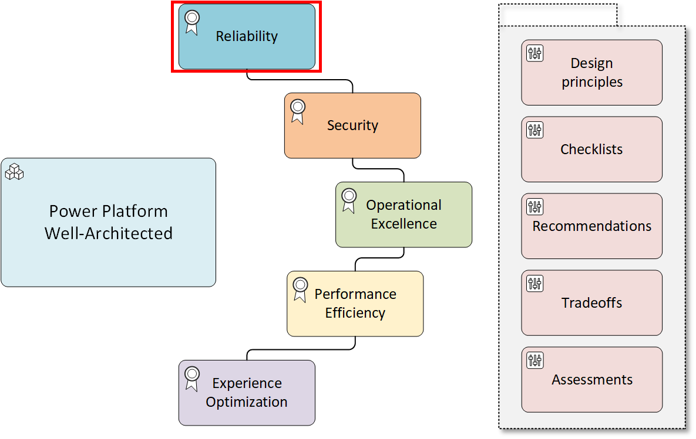

# Reliability Assessment - Failure Mode Analysis

## Question: How do you perform failure mode analysis?

Failure mode analysis (FMA) is the practice of identifying potential points of failure within your workload and the associated flows and planning mitigation actions accordingly. At each step of the flow, you identify the blast radius of multiple failure types, which helps you design a new workload or refactor an existing workload to minimize the widespread effect of failures.

If you skip FMA altogether or perform an incomplete analysis, your workload is at risk of unpredicted behavior and potential outages caused by suboptimal design.

### Comments
This question focuses on the post breakdown of business workflows pertaining to mitigation of potential failures of components within. It will primarily focus on the [RE:03 recommendations](https://learn.microsoft.com/en-us/azure/well-architected/reliability/failure-mode-analysis).

To learn more and get started with Failure Mode Analysis, review the official FMA collection below.

### References
[Well-Architected Framework Failure Mode Analysis](https://learn.microsoft.com/en-us/azure/well-architected/reliability/failure-mode-analysis)

[Official Microsoft Well-Architected Framework Reliability Failure Mode Analysis Collection](https://learn.microsoft.com/en-us/collections/138f02j4p0ge0?&sharingId=37BA9080B82744F0)

## Question Responses

### **We decompose the workload to identify its components and their relationships.**
As you move from ideation to design, you need to identify the component types that are required to support your workload. Your workload determines the necessary components that you must plan for.
#### Comments
Review the components in a business critical workload to determine the impact of a component malfunctioning or being down. If this is a new implementation, specific services or connectors may not be known. Define traits needed for each component.

***Only check this box if you have performed a FMA for each business critical workload.***

### **We identified all internal and external dependencies.**
You understand how your workload depends on external dependencies, such as third-party APIs and identity providers. Typical internal dependencies include APIs or secret/key management solutions like Azure Key Vault. Typical external dependencies include authentication solutions, like Microsoft Entra ID, and Power Platform infrastructure.
#### Comments
*Using first and third party tools, organizations have the capability to extract and review all dependencies. For Power Platform, organizations need to have all connectors and actions documented.
For Dynamics 365, review plug-ins, custom workflow actions, PCF controls and web resources for dependencies.*

**If you have not done this, do not check this box. Consider working with Microsoft experts to have a code review performed with a read out of all artifacts which could include dependencies.**

### **We understand the performance and reliability characteristics of all our internal and external dependencies.**
For each dependency, you maintain a list of its nonfunctional targets, scalability limits, availability, and service-level agreements (SLAs).
#### Comments
***If you have not checked the above checkbox, do not check this one.***

*If you do have your dependencies documented, take it a step further by reviewing each external components' SLA. For internal components, identify the stakeholders and support teams and request the same.*

**Only check this if you have documented all nonfunctional targets.**

### **We identified failure points for all components.**
In your workload's critical flows, we have considered each component and determined how that component, and its dependencies, might be affected by a failure mode. Any one component can be affected by more than one failure mode at any given time, such as regional outages, service outages, app or component misconfiguration, planned maintenance.
#### Comments
*For most workloads that leverage the SaaS platform, part of the licensing and SLA is to ensure uptime. Power Platform services offer an SLA with replication across a geo that will mitigate regional outages.*

*For this answer, consider custom or home grown services. These services could be hosted on-premise or on a cloud and are typically maintained by an organization. As such, each of these needs to be reviewed for failure points listed above.*

*Key quality attributes to look for here are* ***availability*** and ***redundancy***.
#### References
[Identify Azure Failure Points](https://learn.microsoft.com/en-us/azure/well-architected/reliability/failure-mode-analysis#failure-points)

[Identify Power Platform Failure Points](https://learn.microsoft.com/en-us/power-platform/well-architected/reliability/failure-mode-analysis#failure-points)

### **We have failure mitigation strategies.**
From failure mode analysis, you might determine that you can reach defined business targets by combining dependencies. Mitigation can mean either relaxing the requirements or changing the design appropriately.
#### Comments
*Once an FMA has been performed, look for opportunities to reduce dependencies. Review any dependency that does not meet your business uptime guidelines and plan to remove or mark as high risk. Mark each workload's availability based on which component has the weakest availability.*

*A major part of mitigation is observability. Ensure proper monitoring is in place with alerting where applicable.*

*Key quality attributes to look for here are* ***availability***, ***observability*** and ***redundancy***.

**Don't check this box if you have not performed an FMA and reviewed all dependencies documenting if they meet your business objectives.**
#### References
[Azure FMA Mitigation](https://learn.microsoft.com/en-us/azure/well-architected/reliability/failure-mode-analysis#mitigation)

[Power Platform FMA Mitigation](https://learn.microsoft.com/en-us/power-platform/well-architected/reliability/failure-mode-analysis)

### **We have failure detection strategies.**
Failure detection is essential to ensure that you have correctly identified failure points in your analysis and properly planned your mitigation strategies. Detection in this context means the monitoring of your infrastructure, data, and application, and alerting when issues arise. For the failure of each user and system flows, you have a monitoring strategy in place to detect and alert on failure.
#### Comments
*Each service and dependency should provide operational telemetry. If not, consider this a "black box" and a risk. Each service within the Power Platform and Dynamics 365 offer operational telemetry either out of the box or customizable. For more information, please review the series "Monitoring the Power Platform".*

**Do not check this box unless you have documented monitoring for all dependencies of your workload.**
#### References
[Azure FMA Detection](https://learn.microsoft.com/en-us/azure/well-architected/reliability/failure-mode-analysis#detection)

[Power Platform FMA Detection](https://learn.microsoft.com/en-us/power-platform/well-architected/reliability/failure-mode-analysis#detection)

### **We assessed the impact of each failure mode for each of our workload's flows.**
For the failure of each workload flow, you understand whether the impact of the failure is high or low, whether the flow will stop functioning, and how to degrade gracefully.
#### Comments
*As part of the FMA process, each workload and user flow should have a risk assessment performed. The assessment covers each component of the flow (sign-in, front end, service layer, business layer and back end). Each component should document what an outage looks like, the effect it has on the workflow and the party responsible.*

**Do not check this box if you have not performed this exercise.**
#### References
[FMA Template](./docs/Failure%20Mode%20Analysis%20for%20Mission%20Critical%20Applications.docx)

[Power Platform FMA Example](https://learn.microsoft.com/en-us/power-platform/well-architected/reliability/failure-mode-analysis#example)

[Power Platform FMA Outcome](https://learn.microsoft.com/en-us/power-platform/well-architected/reliability/failure-mode-analysis#outcome)

[Azure FMA Outcome](https://learn.microsoft.com/en-us/azure/well-architected/reliability/failure-mode-analysis#outcome)

### **We established continuous improvement processes to reduce dependencies and review our failure mode analysis.**
As the workload evolves, and your external dependencies might also evolve, you continuously re-evaluate how the changes effect the reliability of your workload.
#### Comments
*Do you have time set aside to review current and future architecture? Is the organization collecting all dependencies across all business critical workloads?* 

**If the answer to any of these is no or unsure, do not check this box.**

#### References
[Complete a Power Platform Well-Architected assessment](https://learn.microsoft.com/en-us/power-platform/well-architected/implementing-recommendations)

### **We documented and published the outcome of the failure mode analysis.**
You published the results of the failure mode analysis in a central place to share insights about your workload design, such as the possible failure modes and their mitigation strategies. Your team is aware of these documents and use them to analyze and improve the workload design.
#### Comments
*Do you have a repository for the FMA artifacts? Can responsible parties locate them and link them to any and all components? If not, do not check this box.*
#### References
[Prioritize and implement recommendations](https://learn.microsoft.com/en-us/power-platform/well-architected/implementing-recommendations#prioritize-and-implement-recommendations)

