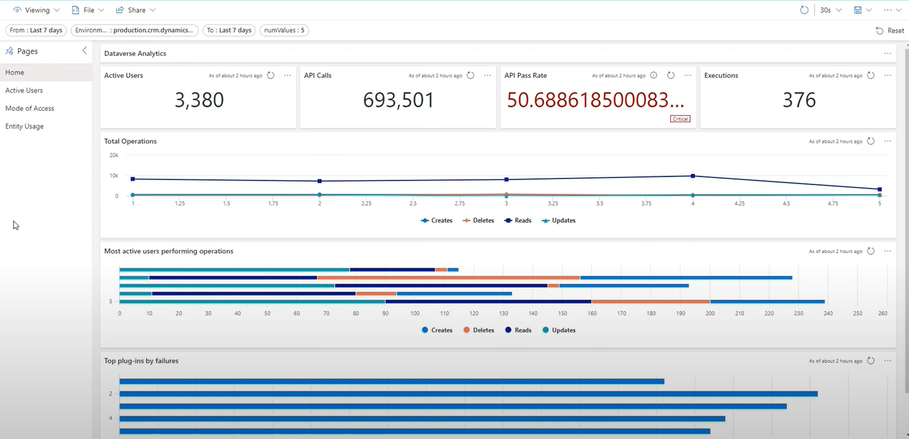

# Reliability Assessment - Target Metrics

## Question: How do you define reliability targets?

Reliability targets are derived through workshop exercises with business stakeholders. The targets are refined through monitoring and testing. With your internal stakeholders, set realistic expectations for workload reliability so that stakeholders can communicate those expectations to customers through contractual agreements.

### Comments
*Power Platform handles most of the infrastructure needed to run its services. That said it is a shared responsibility based on the workloads and strain applied to the platform. Also, as the platform provides extensibility into Azure, the responsibility can shift more towards organizations.* 

*This question will primarily focus on the [RE:04 Target Metrics recommendations](https://learn.microsoft.com/en-us/power-platform/well-architected/reliability/metrics).*

*To learn more and get started with defining target metrics, review the official FMA collection below.*

### References
[Well-Architected Framework Target Metrics](https://learn.microsoft.com/en-us/azure/well-architected/reliability/metrics)

[Official Microsoft Well-Architected Framework Reliability Failure Mode Analysis Collection](https://learn.microsoft.com/en-us/collections/138f02j4p0ge0?&sharingId=37BA9080B82744F0)

[YouTube: Power Platform Well-Architected Framework - Defining a Monitoring Strategy](https://www.youtube.com/watch?v=AvoD66ItJv4)

## Question Responses

### **We have availability targets.**
Reliability targets require metrics like service-level objectives (SLOs), service-level agreements (SLAs), and service-level indicators (SLIs).
#### Comments
**Service Level Objective** - *A target that you set for your workload or application based on the quality of service that your customers expect to receive.*

**Service Level Indicator** - *Measurement of a particular aspect of a service's performance*

**Service Level Agreement** - *Agreement between a service provider and a customer*

*These metrics should come from workshops performed with business and technical stakeholders and should be realistic in nature. SLOs are mandatory for each system and workload.*

**If you do not have an SLO for each workload, do not check this box.**
#### References
[Power Platform Availability targets](https://learn.microsoft.com/en-us/azure/well-architected/reliability/metrics#key-design-strategies)

[Azure Availability targets](https://learn.microsoft.com/en-us/azure/well-architected/reliability/metrics#set-availability-objectives)

### **We have recovery targets.**
Recovery targets correspond to the recovery time objective (RTO), recovery point objective (RPO), mean time to recovery (MTTR), and mean time between failure (MTBF) metrics. In contrast to availability targets, recovery targets for these measurements don't depend heavily on SLAs.
#### Comments
**Recovery Time Objective** - *The maximum acceptable time that an application can be unavailable after an incident.*

**Recovery Point Objective** - *The maximum acceptable duration of data loss during an incident.*

**Mean Time to Recovery** - *The time taken to restore a component after a failure is detected.*

*These metrics rely heavily on your FMA and BC/DR strategy. Organizations will need to work with business stakeholders to discuss aspirations and review architecture.*

**If you have not defined all three of these metrics, do not check this box.**

#### References
[Azure Recovery targets](https://learn.microsoft.com/en-us/azure/well-architected/reliability/metrics#define-recovery-metrics)

[Power Platform Recovery targets](https://learn.microsoft.com/en-us/power-platform/well-architected/reliability/metrics#recovery-metrics)

[Microsoft Service Trust](https://servicetrust.microsoft.com/)

### **We developed a health model based on workload availability and recovery metrics.**
A health model aims to transform your system metrics into data that you can compare against your service-level objectives (SLOs).
#### Comments
*The health model should be based on the availability and recovery targets defined above. With a health model, you are performing an operational maturity assessment. Key things to focus on in the model are: **"How you detect and respond to issues"**, **"How you diagnose issues that have happened"** and now to **"Predict and more importantly prevent issues before they take place"**.*

*Each mission critical workload needs to be analyzed with the health model. Below is an example of a readable health model*

**If you have not analyzed and documented with a health model, do not check this box.**

#### References
[Power Platform Health Model](https://learn.microsoft.com/en-us/power-platform/well-architected/reliability/metrics#building-a-health-model)

[Building a Monitoring and Alerting strategy](https://learn.microsoft.com/en-us/power-platform/well-architected/reliability/monitoring-alerting-strategy)

[Health modeling of mission-critical workloads in Azure](https://learn.microsoft.com/en-us/azure/well-architected/mission-critical/mission-critical-health-modeling)

[Monitoring the Power Platform](https://github.com/aliyoussefi/MonitoringPowerPlatform)

[Application Insights Artifacts for Dataverse](https://github.com/microsoft/AzureMonitorCommunity/tree/master/Azure%20Services/Dataverse)

[Application Insights Artifacts for Power Platform](https://github.com/microsoft/AzureMonitorCommunity/tree/master/Azure%20Services/Power%20Platform)
### **We agree on definitions of healthy, degraded, and unhealthy states for the workload.**
Agreeing on what constitutes a healthy or degraded operation is crucial for design discussions.
#### Comments
*Below are recommended health states for the model including definitions.*

**Healthy** - *Operates optimally and meets quality expectations*

**Degraded** - *Exhibits less than healthy behavior, which indicates potential problems*

**Unhealthy** - *In a critical state and requires immediate attention*

**If you have not defined health states do not check this box**
#### References
[Azure Recommended Health States](https://learn.microsoft.com/en-us/azure/well-architected/cross-cutting-guides/health-modeling#what-is-health-health-modeling-and-a-health-model)

[Power Platform Health States](https://learn.microsoft.com/en-us/power-platform/well-architected/reliability/metrics#building-a-health-model)

### **We implemented a process or technology to inform stakeholders of application health.**
You have visualization or reporting in place that informs stakeholders about the overall state of the workload. Dashboards can also be reports by email, instant messaging, or wiki that notify business stakeholders when the health state changes.
#### Comments
*Visualizations can come in many forms. Dashboards, Azure workbooks, reports, etc. are all viable options. Based on the stakeholder and responsible parties, consider the access needed to underlying data and any licenses needed to review.*

*The following example shows an Azure Data Explorer dashboard visualizing Dataverse telemetry.*

**If you haven't created a dashboard showcasing telemetry for Dataverse and Power Platform services, do not check this box.**

#### References
[Visualizing Application Health](https://learn.microsoft.com/en-us/power-platform/well-architected/reliability/metrics#visualization)

[Azure Dashboard](https://learn.microsoft.com/en-us/azure/azure-portal/azure-portal-dashboards)

[Power Automate Workbooks](https://github.com/microsoft/AzureMonitorCommunity/tree/master/Azure%20Services/Power%20Platform/Power%20Automate/Workbooks)

[Dataverse Dashboards](https://github.com/microsoft/AzureMonitorCommunity/tree/master/Azure%20Services/Dataverse/Dashboards/PowerPlatformAdminCenterAnalytics)

[Dataverse Workbooks](https://github.com/microsoft/AzureMonitorCommunity/tree/master/Azure%20Services/Dataverse/Workbooks)