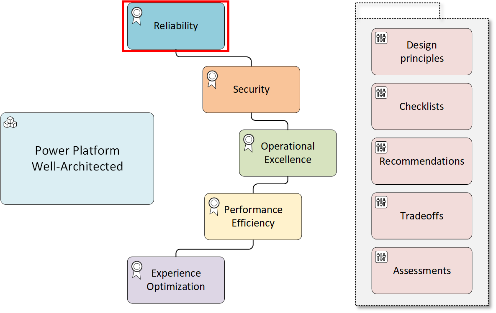

# Reliability Assessment - Background and Async Jobs

## Question: How do you implement background jobs?

Background jobs run automatically without the need for user interaction. Background jobs help minimize the load on the application UI, which improves availability and reduces interactive response time.

### Comments
*This question focuses on [RE:05 Background Jobs](https://learn.microsoft.com/en-us/power-platform/well-architected/reliability/background-jobs). Key areas include understanding of polling and pushing triggers, long running workflows and resource intensive jobs.*

## Question Responses

### [X] **We use trigger conditions to reduce the number of unnecessary runs**
Trigger conditions set up multiple conditions that must be met before a workflow is triggered. Use trigger conditions to streamline your workflows and reduce the number of unnecessary runs.
#### Comments
*Organizations should evaluate Dataverse and Power Automate triggered business logic to ensure filtering. Take an audit of all update messages in Dataverse plug-ins and review for filtering attributes. For Power Automate, review all triggers based off an event and ensure filtering conditions are applied. Without this, unnecessary strain will be added to the platform.*

**NOTE - If you have not audited all plug-ins and flow triggers, do not check this box. Consider a Microsoft led Code Review or Solution Checker to assist here.**

#### References
[Power Automate - Customize a trigger by adding conditions](https://learn.microsoft.com/en-us/power-automate/triggers-introduction?tabs=classic-designer#customize-a-trigger-by-adding-conditions)

[Dataverse - Include filtering attributes with plug-in registration](https://learn.microsoft.com/en-us/power-apps/developer/data-platform/best-practices/business-logic/include-filtering-attributes-plugin-registration)

### [X] **We have well defined return results for background jobs.**
Background jobs run asynchronously in a separate process from the UI or the process that invoked the background job. If you require a background task to communicate with the calling task to indicate progress or completion, you must return a well defined and documented status indicator.
#### Comments
*Telemetry and correlating identifiers are key here. With distributed transactions that leverage message brokers, being able to use an identifier across services will be paramount to quick remediation.*

**NOTE - If you are not returning statuses and identifiers in plug-ins or flow responses, do not check this box.**
#### References

### [X] **We have evaluated all steps of the background job and decomposed a task into multiple reusable steps.**
Background tasks can be complex and require multiple tasks to run. Evaluate if you can divide the task into smaller discrete steps or subtasks that multiple consumers can run.
#### Comments
*Code reusability is key to code health. Identify redundant code and work to reduce your footprint into smaller tasks. Power Automate child flows provide a mechanism for low code.*

**NOTE - If you haven't reviewed a background job, for instance a flow, for repeatability do not check this box.**

#### References
[Power Automate - Create Child Flows](https://learn.microsoft.com/en-us/power-automate/create-child-flows)

[Azure - Background Job Coordination](https://learn.microsoft.com/en-us/azure/well-architected/reliability/background-jobs#coordination)

### [X] **We planned background jobs to provide a reliable service for the workload.**
Create resilient background tasks to provide reliable services for the application. Background tasks need to gracefully handle restarts without corrupting data or introducing inconsistency into the application.
#### Comments
*Partly covered in the previous question, ensure that transient faults or other communication issues are handled gracefully. Queues and message brokers offer solutions that can assist.*

**NOTE - If you have not reviewed all background tasks and implemented a retry patten or a queue based pattern, do not check this box.**

#### References
[Azure Resiliency Considerations](https://learn.microsoft.com/en-us/azure/well-architected/reliability/background-jobs#resiliency-considerations)

[Power Platform Manage Operations that Continually Fail](https://learn.microsoft.com/en-us/power-platform/well-architected/reliability/handle-transient-faults#manage-operations-that-continually-fail)

### [X] **We planned background jobs to offer sufficient performance for the workload.**
Background tasks must offer sufficient performance to ensure that they don't block the application or delay operation when the system is under load.
#### Comments
*Any custom hosted functionality needs to offer resources to handle load. Azure Functions, data sync integration tools, etc are all areas to focus on.*

**NOTE - If you have not or are not continuously evaluating performance of background jobs for business critical workloads, do not check this box.**

#### References

