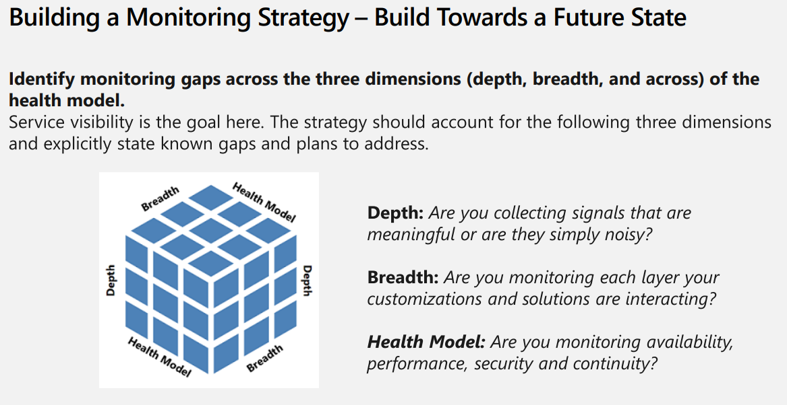

# Reliability Assessment - Monitoring Health

## Question: How do you plan to monitor health?

A reliable monitoring and alerting strategy can keep your operations teams informed of your environment's health status and ensure that you meet the established reliability targets for your workload.

### Comments
*Simply enabling Application Insights or telemetry export isn't enough to establish a monitoring strategy. Thresholds need to be defined and alerts created to measure. Dashboards should be available for stakeholders. This question will focus on identifying monitoring gaps and coverage of your business applications.*

## Question Responses

### [X] **We can monitor each flow of our workload individually and assess its health state.**
Your monitoring strategy targets each flow individually to assess its individual health state. You can assess your flow's health state based on your health model, which is driven by your committed service-level objectives (SLOs) and service-level agreements (SLAs).
#### Comments
Power Platform provides emails for Power Automate flows when there may be an issue. Depending on the SLA for the flow this may not be quick enough and its recommended to leverage Azure Application Insights either out of the box or [through API calls](https://community.dynamics.com/blogs/post/?postid=00fef8a0-cf80-4291-a6cd-343fa7d2c131).

#### References
[Monitoring the Power Platform: Power Automate - Run Time Part 3: Implementing a Monitoring Strategy](https://community.dynamics.com/blogs/post/?postid=00fef8a0-cf80-4291-a6cd-343fa7d2c131)

[YouTube - Monitoring the Power Platform Bootcamp S07: Monitoring Power Automate](https://youtu.be/MaIaryLQ9GQ?si=lCAJ_fmYdhGmoutU)

[Monitoring the Power Platform Bootcamp S04: Managing Azure Outages and Building Alerts](https://www.youtube.com/watch?v=VXfnVS2Cu7A)
### [X] **We ensure our team is familiar with telemetry at various levels.**
Your team understands which metrics, logs, and traces are available across various levels, such as the platform, infrastructure, and application levels.
#### Comments
***Application** logs come from the out of the box Azure Application Insights feature for both Dataverse apps and Power Apps Canvas Apps. These logs should tell you about the user interactions and how things are performing for the user.*

***Platform** logs can come from the Power Platform API, Dataverse with Microsoft Purview and Azure Application Insights for Power Automate.*

***Infrastructure** information comes from the telemetry export for Dataverse. This contains information how request and dependent calls within are executing. Service Communications are exposed via dashboards or through an API allowing for a quick visual for administrators and operations teams.*

**NOTE - If you cannot define where the logs for each of the sections above, do not check this box.**

#### References
[YouTube - Power Platform Well-Architected Framework - Monitoring Tools and Scenarios](https://youtu.be/bXs57Zk7vjY?si=FtR1OQEqvHuzlqxa)

[YouTube - Monitoring the Power Platform Bootcamp S06: Understanding Application Insights Tables](https://www.youtube.com/watch?v=X7dKnkXBjGI)
### [X] **We're intentional about our monitoring system design.**
You're intentional about data sources and the retention time, so you can balance comprehensiveness of data with data sovereignty and cost efficiency.
#### Comments
*Dataverse and Power Automate out of the box Azure Application Insights integration allow for granular configuration. Consider the ingress of data and adjust accordingly.*

*Generally speaking, I recommend enabling in a lower environment to ensure a balance of accurate and informative telemetry with cost effectiveness.*

**NOTE - If you have not reviewed the configuration of Azure Application Insights, both within the maker portal and within Azure, do not check this box.**
#### References
[Export data to Application Insights](https://learn.microsoft.com/en-us/power-platform/admin/set-up-export-application-insights)

[Set up Application Insights with Power Automate](https://learn.microsoft.com/en-us/power-platform/admin/app-insights-cloud-flow)

[Set daily cap on Log Analytics workspace](https://learn.microsoft.com/en-us/azure/azure-monitor/logs/daily-cap)

### [X] **We send out alerts when the health of a flow degrades.**
You send alerts to a defined set of operators when the health state of flows decreases. Operators know how to handle the incidents or where to find instructions. You also consider sending proactive notifications when health states improve.
#### Comments

#### References
[Monitoring the Power Platform Bootcamp S04: Managing Azure Outages and Building Alerts](https://www.youtube.com/watch?v=VXfnVS2Cu7A)

[Create alerts for cloud flow run failures](https://learn.microsoft.com/en-us/power-platform/admin/app-insights-cloud-flow#create-alerts-for-cloud-flow-run-failures)
### [X] **We present the workload and individual flow health in a simple visual to users who have the right permissions.**
You present the health state of the workload and its individual flows by using dashboards that provide the appropriate insights for the individual user. An appropriate visual, for example a colored box or a traffic light, is prominently positioned on the dashboard to provide immediate insight into the current workload state: healthy, degraded, or unhealthy.
#### Comments
*Power BI, Azure Dashboards and Azure Data Explorer all provide opportunities to display visuals of application health.
Ensure that all flows are displayed and if there is an issue a visual indicator is shown.*

**NOTE - If a dashboard is not available for stakeholders to review application health, do not check the box.** 

#### References
[YouTube - Overview of Power Platform Monitoring](https://youtu.be/hEIPK1hdLYc?si=MmiSxmAZgi5tNLI7)

### [X] **We've taken measures to stay updated on the health of platforms that our workload depends on.**
Incorporate cloud platform monitoring and alerting services, including platform-level health and resource-level health. To mitigate health impacts, the relevant mechanisms and processes utilize these services.
#### Comments
*Alerts, dashboards and automated communication channels created when an event happens all should be part of your monitoring strategy.*

**NOTE - If none of these are created, do not check this box.**

#### Reference
[YouTube - Overview of Power Platform Monitoring](https://youtu.be/hEIPK1hdLYc?si=MmiSxmAZgi5tNLI7)